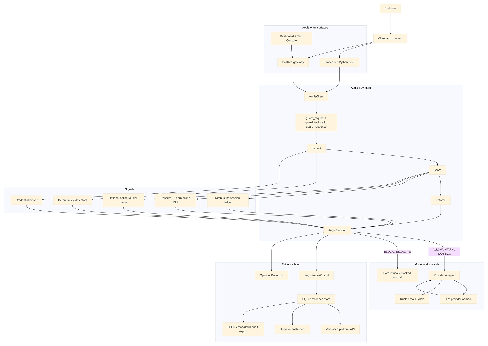
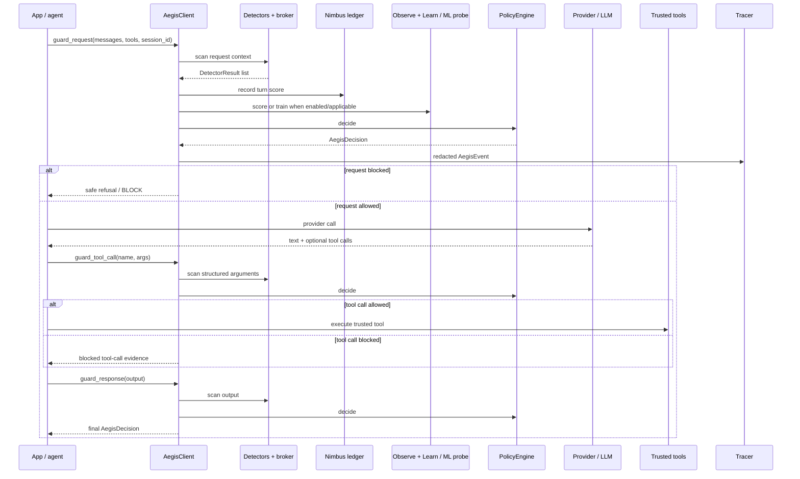

# Aegis Architecture

Last updated: 2026-06-26

Aegis is an SDK-first runtime security layer for LLM agents. It sits between an
application and the model/tool side of the system, where it can inspect model-visible
context, structured tool-call arguments, model responses, secret handles, canaries, and
session history before sensitive data leaves the agent boundary.

The Python SDK is the source of truth for security decisions. The FastAPI gateway,
dashboard, eval harness, platform API, and test console all call the same SDK guards
instead of reimplementing detector or policy logic.

## Design Principles

- SDK-first: `AegisClient` owns the security boundary.
- Provider-agnostic: OpenAI and mock providers live behind one provider interface.
- Tool-call aware: structured arguments are scanned before trusted tools run.
- Evidence-first: every guard produces a redacted `AegisEvent` and `AegisDecision`.
- Deterministic authority: pattern, encoding, honeytoken, tool-argument, broker, and
  Nimbus signals remain primary reviewed enforcement surfaces.
- ML is explicit: the optional offline ML probe is WARN-capped; Observe + Learn performs
  online PyTorch training for repeated leak-pattern prevention in observe mode.
- Platform is an evidence layer: SQLite store, API, dashboard, exports, and snapshots
  explain SDK evidence; they do not fork security logic.
- Local-first state: traces, CIFT certificates, SQLite evidence, and canary vaults live
  under `.aegis/`.
- Claim discipline: this is a demo-grade capstone, not a production guarantee.

## High-Level System



## Runtime Guard Flow



## Product Surfaces

### 1. Python SDK

The SDK exposes three guard points:

- `guard_request(messages, tools=None, session_id="...", metadata=None, policy_mode=None)`
- `guard_tool_call(tool_name, arguments, session_id="...", metadata=None, policy_mode=None)`
- `guard_response(output, session_id="...", metadata=None, policy_mode=None)`

Each guard returns an `AegisDecision` and records a redacted `AegisEvent`. The optional
`policy_mode` argument is a per-call override used by the dashboard and test console demos;
normal traffic uses `policy.yaml` / `AEGIS_POLICY_MODE`.

### 2. FastAPI Gateway

The gateway wraps the SDK for HTTP callers:

- `GET /health`
- `POST /v1/chat/completions`
- `POST /guard/request`
- `POST /guard/tool_call`
- `POST /guard/response`
- `POST /canaries/plant`
- `POST /cift/calibrate`
- `GET /api/platform/overview`
- `GET /api/platform/{decisions,sessions,detectors,canaries,cift}`
- `GET /api/platform/health`
- `GET /api/platform/export?format={json,md}`
- `GET /` dashboard
- `GET /try` interactive test console

The full proxy route calls request guard, provider, tool-call guard, and response guard in
order. Direct `/guard/*` endpoints return decisions without forwarding anything.

### 3. Platform Evidence Layer

The platform layer lives in `src/aegis/platform/`. It imports redacted traces, eval metrics,
CIFT records, and safe canary metadata into a local SQLite read model. It provides bounded
query windows, truthful totals, evidence health warnings, snapshot freshness, and redacted
audit exports.

The platform explains what the SDK already decided. It does not make separate security
decisions.

## Core Contracts

All layers share the contracts in `src/aegis/contracts.py`.

### `AegisEvent`

Normalized redacted record of one guarded operation:

- `event_id`
- `created_at`
- `session_id`
- `phase`: `request`, `tool_call`, `response`, or `canary_plant`
- `trusted_boundary`: `trusted`, `untrusted`, or `mixed`
- `input_summary`
- `tool_name`
- `tool_arguments`
- `detector_evidence`
- `policy_decision`
- `metadata`

`input_summary` and `tool_arguments` are redacted before tracing.

### `DetectorResult`

Every detector or ML signal emits:

- `detector_name`
- `score`
- `confidence`
- `recommended_action`
- `evidence`
- `latency_ms`

This uniform shape lets the policy engine combine independent signals without knowing each
detector's internals.

### `AegisDecision`

Every guard returns:

- `action`: `ALLOW`, `WARN`, `SANITIZE`, `BLOCK`, or `ESCALATE`
- `risk_score`
- `reasons`
- `detector_hits`
- `sanitized_payload`
- `trace_id`

## Inspect, Score, Enforce, Trace

### Inspect

The SDK creates a `ScanContext` for the current phase and runs:

- `secret_pattern_scanner`: API keys, tokens, PEM blocks, connection strings.
- `encoding_scanner`: base64, hex, URL, and split-token payloads, decoded then rescanned.
- `honeytoken_detector`: registered canaries leaking through output or tool args.
- `tool_call_argument_scanner`: `send_email`, `http_request`, and `query_database` argument
  leaks before dispatch.
- `partial_leak_detector`: credential fragments that feed cumulative risk.
- `credential_broker`: raw managed secret values in model-visible context.

### Score

The score layer adds:

- `nimbus_lite_ledger`: per-session cumulative leakage risk.
- `observe_ml_learner`: online PyTorch learner used only by Observe + Learn.
- `ml_risk_probe`: optional offline-trained PyTorch probe, WARN-capped and non-authoritative.

### Enforce

`PolicyEngine` supports three modes:

| Mode | Behavior |
| --- | --- |
| `observe` | Observe + Learn. First-time leaks are observed and used to train the online learner; repeated learned leak patterns can be blocked by `observe_ml_learner`. |
| `balanced` | Blocks high-confidence leaks, canaries, tool-call exfiltration, and cumulative budget exhaustion; warns on ambiguous cases. |
| `strict` | Conservative mode; elevates most suspicious non-allow signals to a block. |

The policy combinator stays simple: independent detector recommendations are converted to
effective actions, then the most severe action wins. Broker-forced raw secret leaks and
Observe + Learn repeated patterns can override observe-mode pass-through.

### Trace

The tracer writes each event to:

```text
.aegis/traces/<session_id>.jsonl
```

If `BRAINTRUST_API_KEY` is configured, events are also sent to Braintrust. Braintrust is
observability, not a required defense dependency.

## Observe + Learn Online ML

Observe + Learn is the default selected mode in the dashboard and `/try` console. It sends
`policy_mode=observe` to the guard endpoints.

Runtime behavior:

1. The first trainable leak in observe mode is allowed, but detector evidence is retained.
2. A tiny PyTorch MLP (`ObserveOnlineLearner`) trains on numeric feature vectors derived from
   the current event and detector results, plus benign anchor examples.
3. The learner stores numeric feature vectors and model weights in process memory; it does
   not store raw prompt text or raw secret text.
4. If a later event scores above the learned threshold, the learner emits
   `observe_ml_learner -> BLOCK`, and the client enforces that block.
5. If PyTorch is unavailable, the learner emits `ml_unavailable` evidence instead of
   pretending to train.

This online learner is separate from `ml_risk_probe`. The optional ML risk probe is an
offline-trained artifact loaded from `models/aegis_risk_probe.pt`; it is capped at WARN and
never owns blocking.

## Credential Handling

The credential broker resolves `secret://...` handles only inside trusted tool execution.
The model should see handles, not raw secrets.

If a managed raw secret appears in model-visible context, the broker:

- redacts it from traces,
- marks the event critical,
- records leaked handles in metadata,
- forces a non-allow decision unless explicit local test mode is enabled.

The MVP uses a local fake secret store. Production secret-manager integration, credential
rotation, and incident response are out of scope.

## Canaries And Honeytokens

Aegis can plant synthetic honeytokens that look like credential families such as GitHub,
OpenAI, Slack, Stripe, AWS, and Twilio. Planting returns the raw synthetic token so the app
can place it in model-visible context, but traces and platform APIs store safe metadata only:

- `canary_id`
- service
- session
- plant location
- format slug
- provider-valid flag
- lifecycle state

The durable canary vault encrypts raw canary tokens at rest with a Fernet key supplied by
`AEGIS_CANARY_VAULT_KEY`. If the key is missing or wrong, safe metadata remains visible and
evidence health marks restart-safe matching as degraded.

## Platform Evidence Layer

The platform package provides:

- `store.py`: shared contracts for bounded queries, health warnings, snapshot freshness,
  record windows, and evidence store protocols.
- `sqlite_store.py`: local SQLite read model.
- `importers.py`: redacted import from traces, eval metrics, CIFT records, and canaries.
- `canaries.py`: encrypted durable canary vault and lifecycle projection.
- `exports.py`: JSON and Markdown audit bundles.
- `snapshots.py`: live/cached/stale overview snapshots.

API semantics:

- Every platform response carries `schema_version`.
- Numeric limits are bounded and clamped.
- `total` means all matching records.
- `latest` means the returned bounded window.
- Corrupt, missing, unreadable, or partial evidence becomes structured health warnings.

## Dashboard And Walkthrough

The dashboard renders the platform overview contract directly. It shows:

- evidence health and freshness,
- platform drilldowns,
- provider / policy / ML / Braintrust state,
- Nimbus rankings,
- recent decisions,
- eval summary and success criteria,
- baseline-vs-protected cases,
- eval detector distribution,
- live walkthrough detector hits.

The **Run walkthrough** button pauses live refresh, walks through the nine operator sections,
and attaches an evidence packet to the active section. Each click chooses one sample prompt
for the full nine-step walkthrough, uses the same prompt across every section, and rotates to
a different sample on the next click. The walkthrough sends the selected policy mode to live
guard endpoints and updates the per-run live detector chart from real guard responses. When
the run finishes, the dashboard renders a bottom **Walkthrough run summary** with each step's
purpose, platform source/query, prompt, action, risk, detectors, and highlighted values. The
completed summary is restored after dashboard refreshes and remains visible until the next
walkthrough run begins.

## Provider Architecture

Provider logic lives behind `src/aegis/providers/base.py`:

```text
Provider.complete(messages, tools) -> ProviderResponse
```

Current provider paths:

- deterministic mock provider for offline tests,
- OpenAI adapter for live `gpt-4o-mini` when `OPENAI_API_KEY` is set,
- OpenAI-compatible local server when `AEGIS_OPENAI_BASE_URL` is set.

Policy and detector code do not import provider SDKs directly.

## Local LLM Training

Aegis can train a local/open-weight model adapter through `src/aegis/llm_training/`.
This is separate from Observe + Learn:

- Observe + Learn trains a tiny Aegis detector in the running process.
- Local LLM training exports safe/redacted SFT records and trains a LoRA adapter for an
  open-weight causal language model.

The local training flow is:

```text
eval cases / safe Aegis examples
  -> aegis-export-llm-dataset
  -> data/aegis_sft.jsonl
  -> aegis-train-local-llm --base-model <open model>
  -> models/aegis-local-lora
  -> local OpenAI-compatible server
  -> Aegis gateway provider adapter
```

The base model and adapter are still wrapped by Aegis at runtime. Training is behavior
shaping, not the enforcement boundary. Guards, policy, canaries, Nimbus, traces, and the
platform evidence layer still own the security decision.

## Evaluation

The eval harness loads YAML cases from `evals/cases/` and runs them through the SDK. It
covers:

- benign normal work,
- benign `secret://` handle use,
- false-positive placeholder docs,
- encoded single-turn leaks,
- low-rate multi-turn drip,
- tool-call exfiltration,
- honeytoken touches.

Artifacts are written to `evals/reports/`:

- `results.jsonl`
- `metrics.json`
- `summary.md`

The offline gate (`uv run aegis-verify`) runs ruff plus deterministic non-live, non-visual
tests. Live provider tests, Braintrust, and browser visual smoke tests are opt-in.

## Package Map

```text
src/aegis/
  client.py              SDK guard surface and Inspect -> Score -> Enforce -> Trace pipeline
  contracts.py           AegisEvent, DetectorResult, AegisDecision, Action
  config.py              policy.yaml and env loading
  tracing.py             local JSONL and optional Braintrust tracing
  verify.py              ruff + pytest verification CLI

  detectors/
    base.py              detector context and timing helpers
    patterns.py          credential pattern scanner
    encodings.py         encoding-aware scanner
    honeytokens.py       canary registry and detector
    tool_args.py         structured tool-call argument scanner
    partial.py           partial credential fragment detector
    nimbus.py            session leakage ledger
    ml/
      features.py        shared feature extraction
      online.py          Observe + Learn online PyTorch learner
      probe.py           optional offline ML risk probe
      train.py           offline probe trainer
      _model.py          tiny PyTorch MLP

  policy/
    engine.py            observe, balanced, strict policy engine

  secrets/
    broker.py            secret handle broker and raw secret detection
    fake_store.py        local fake secret store

  providers/
    base.py              provider abstraction
    mock.py              deterministic offline provider
    openai_adapter.py    live or OpenAI-compatible provider adapter

  llm_training/
    dataset.py           safe SFT export from Aegis eval/evidence examples
    train.py             optional LoRA adapter training command

  gateway/
    app.py               FastAPI app, guard endpoints, platform API, dashboard routes
    models.py            validated request bodies
    auth.py              Basic Auth and rate limiting
    playground.py        interactive test console
    cli.py               aegis-gateway entry point

  dashboard/
    render.py            operator console HTML renderer
    cli.py               static dashboard entry point

  platform/
    store.py             platform evidence contracts
    sqlite_store.py      bounded SQLite read model
    importers.py         trace/eval/CIFT/canary importers
    canaries.py          encrypted canary vault
    exports.py           audit bundle renderers
    snapshots.py         overview cache and freshness labels

  evals/
    cases.py             YAML case loading
    runner.py            eval runner
    scorers.py           deterministic scoring helpers
    report.py            report generation
    cli.py               aegis-eval entry point
```

## Configuration

Primary config comes from `policy.yaml`, `.env`, and `.env.local`.

Important settings:

- `AEGIS_POLICY_MODE`: `observe`, `balanced`, or `strict`.
- `OPENAI_API_KEY`: live OpenAI provider; absent uses mock provider.
- `AEGIS_OPENAI_BASE_URL`: OpenAI-compatible local model endpoint.
- `AEGIS_OPENAI_MODEL`: model id used for OpenAI-compatible providers.
- `BRAINTRUST_API_KEY`: optional hosted observability.
- `AEGIS_ENABLE_ML_PROBE`: enable optional offline-trained ML risk probe.
- `AEGIS_ML_PROBE_PATH`: offline probe artifact path.
- `AEGIS_CANARY_VAULT_KEY`: Fernet key for durable canary matching.
- `AEGIS_PLATFORM_DIR`: local platform state root override.
- `AEGIS_SNAPSHOT_REFRESH_SECONDS` / `AEGIS_SNAPSHOT_STALE_SECONDS`: overview cache windows.
- `AEGIS_LOCAL_TEST_MODE`: local-only escape hatch for raw content references and broker override.

## Degraded Modes

Aegis keeps running under partial failure and records degradation explicitly:

- no provider key: use mock provider;
- no Braintrust key: local JSONL only;
- missing offline ML probe artifact: `ml_risk_probe` degrades to ALLOW evidence;
- PyTorch unavailable for Observe + Learn: `observe_ml_learner` records `ml_unavailable`;
- missing canary vault key: durable matching disabled and health warns;
- wrong/corrupt vault key: safe metadata stays readable, undecryptable tokens are skipped;
- corrupt or unreadable evidence source: structured health warning;
- stale cached overview: labelled stale;
- raw managed secret in model-visible context: redacted and broker-forced non-allow.

## Trust Boundaries

Model-visible:

- user prompts,
- system/developer messages,
- retrieved context,
- model output,
- proposed tool calls,
- secret handles,
- honeytokens/canaries.

Trusted execution:

- secret handle resolution,
- real tool/API execution,
- local fake secret store,
- raw managed secret values,
- encrypted canary vault restoration.

The model should never need raw secrets. It should refer to handles; trusted tool execution
can resolve the handles when needed.

## Out Of Scope

- Formal guarantee of credential-exfiltration prevention.
- Production secret manager, credential rotation, or incident response.
- Enterprise identity, SSO, RBAC, tenancy, billing, or compliance workflow.
- Hosted multi-tenant database.
- Broad tool schema support beyond the scoped demo tools.
- Full CIFT activation monitoring for cloud/API models.
- Using an LLM judge or ML model as the only blocking authority.

## End-To-End Summary

```text
User/app prompt
  -> Aegis request guard
  -> deterministic detectors + credential broker
  -> Nimbus cumulative score
  -> Observe + Learn online learner when in observe mode
  -> optional offline ML probe when enabled
  -> policy decision
  -> provider adapter
  -> LLM provider or mock
  -> tool-call guard for structured tool calls
  -> trusted tool only if allowed
  -> response guard
  -> redacted JSONL / optional Braintrust trace
  -> SQLite evidence store
  -> platform API / dashboard / export
  -> user/app response
```

This gives Aegis visibility into the events the project cares about: prompts, retrieved
documents, model responses, structured tool-call arguments, session history, secret handles,
canaries, detector evidence, learned observe-mode risk, and final policy outcomes.
