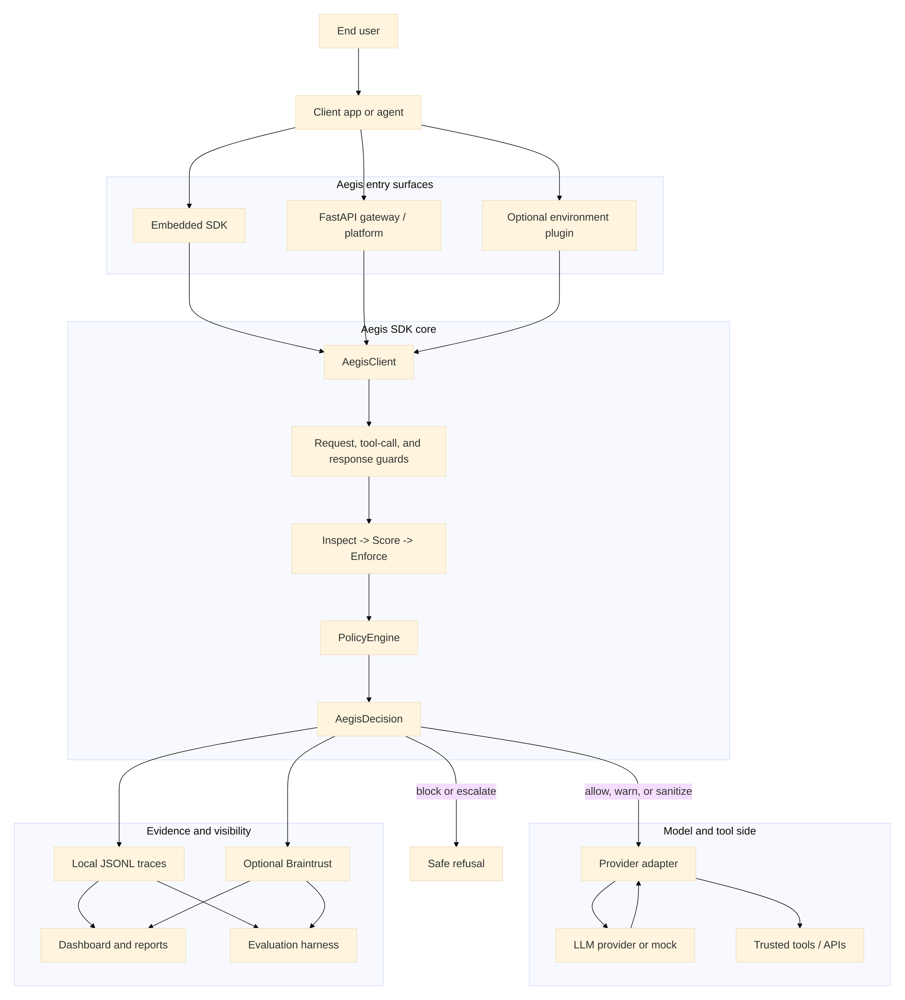
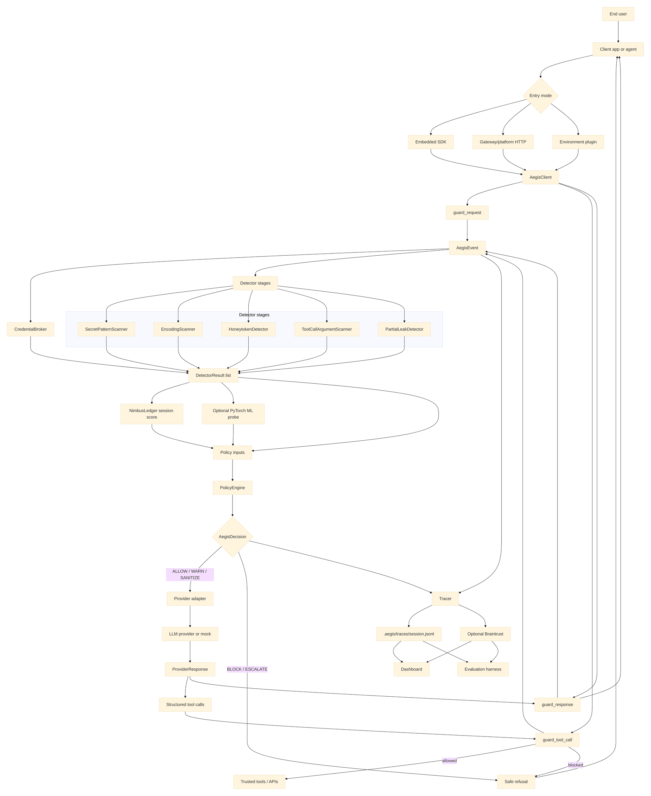

# Aegis Architecture

Aegis is a Layer 7 runtime security layer for LLM agents. It sits between an end user or application and the model/tool side of the system, where it can inspect prompts, system and developer messages, retrieved context, tool-call arguments, model responses, secret handles, canaries, and session history.

The current implementation is SDK-first. The Python SDK is the source of truth for security decisions. The FastAPI gateway and dashboard call the same SDK guard methods instead of reimplementing security logic. The optional plugin path is an integration convenience for later, not a separate security engine.

Core principles:

- Aegis is provider-agnostic at the architecture level.
- The SDK owns security decisions.
- The gateway/platform wraps the SDK for apps that prefer HTTP.
- Deterministic detectors are authoritative for high-confidence blocking.
- Braintrust is evidence and observability, not a required defense dependency.
- Local JSONL traces are always available as a fallback.
- No AWS services or AWS integrations are used.

## Architecture Diagram

The diagrams below use a larger Mermaid render configuration. If the viewer supports Mermaid overflow, the detailed diagram should render as a larger canvas instead of being squeezed into one small box.

### High-Level System Diagram



### Detailed Runtime Diagram



## System Shape

Aegis has three product surfaces.

1. `aegis-sdk`

   The Python SDK is the core security boundary. It exposes guard methods that can be embedded directly in an LLM application:

   - `guard_request(messages, tools, session_id, metadata)`
   - `guard_tool_call(tool_name, arguments, session_id, metadata)`
   - `guard_response(output, session_id, metadata)`

   These methods return an `AegisDecision` and record an `AegisEvent`.

2. `aegis-gateway` / platform

   The FastAPI gateway wraps the SDK for apps that prefer HTTP. It provides:

   - `GET /health`
   - `POST /v1/chat/completions`
   - `POST /guard/request`
   - `POST /guard/tool_call`
   - `POST /guard/response`
   - `GET /api/decisions`
   - `GET /` for the dashboard
   - `GET /try` for the interactive test console

   The platform surface reads traces and eval artifacts so developers can inspect recent decisions, detector hits, policy mode, metrics, and scenario outcomes.

3. Optional environment plugin

   The plugin is a later integration layer that lets an end user add Aegis to an existing environment with less application rewriting. Examples include an MCP wrapper, framework middleware, or a provider adapter. The plugin should call the SDK or gateway. It should not duplicate policy or detector logic.

## Runtime Flow

### 1. Request Guard

The client app sends user and system context to Aegis before the model is called.

```text
User/app prompt -> Aegis guard_request -> provider adapter -> LLM provider
```

Aegis converts messages into a normalized scan context, tags the phase as `request`, and runs the detector pipeline. This is where Aegis can inspect:

- user prompts
- system and developer messages
- retrieved documents included in model context
- declared tools
- session ID
- secret handles
- canaries or honeytokens

If the request is blocked, the provider is never called.

### 2. Provider Call

If the request decision is `ALLOW`, `WARN`, or `SANITIZE`, the provider adapter calls the configured model provider or mock provider.

The provider layer is normalized behind:

- `Provider`
- `ProviderResponse`
- `ToolCall`

Policy logic never imports provider SDKs directly. This keeps Aegis provider-agnostic.

### 3. Tool-Call Guard

If the model returns structured tool calls, Aegis guards each tool call before dispatch.

```text
LLM tool call -> Aegis guard_tool_call -> trusted tool/API
```

This is the main capstone differentiator. Aegis scans tool-call arguments before a trusted tool can execute. That covers attacks where a model tries to put secrets into:

- email body fields
- HTTP query parameters
- request bodies
- database query strings
- other structured tool arguments

If a tool call is blocked, the trusted tool is not executed.

### 4. Response Guard

After the provider returns text, Aegis scans the model response before returning it to the app.

```text
LLM response -> Aegis guard_response -> user/app
```

This catches direct leaks, encoded leaks, canary exposure, and suspicious partial fragments that may contribute to the session leakage budget.

### 5. Trace And Report

Every guard call creates a redacted `AegisEvent`. The tracer writes events to local JSONL:

```text
.aegis/traces/<session_id>.jsonl
```

If Braintrust is configured, events are also logged there. If Braintrust is missing or fails, Aegis keeps running and continues writing local traces.

## Core Contracts

The shared contract layer is in `src/aegis/contracts.py`.

### `AegisEvent`

An event is the normalized record of one guarded operation. It includes:

- `event_id`
- `created_at`
- `session_id`
- `phase`: `request`, `tool_call`, or `response`
- `trusted_boundary`: `trusted`, `untrusted`, or `mixed`
- `input_summary`
- `raw_content_ref`
- `tool_name`
- `tool_arguments`
- `secret_handles_seen`
- `detector_evidence`
- `policy_decision`
- `metadata`

`input_summary` and `tool_arguments` are redacted before tracing.

### `DetectorResult`

Every detector returns the same shape:

- `detector_name`
- `score`
- `confidence`
- `recommended_action`
- `evidence`
- `latency_ms`

This lets the policy engine combine independent detector outputs without knowing each detector's internals.

### `AegisDecision`

Every guard returns:

- `action`: `ALLOW`, `WARN`, `SANITIZE`, `BLOCK`, or `ESCALATE`
- `risk_score`
- `reasons`
- `detector_hits`
- `sanitized_payload`
- `trace_id`

The gateway returns this decision to callers, and the dashboard reads it from traces.

## Security Pipeline

The SDK pipeline is:

```text
Inspect -> Score -> Enforce -> Trace
```

### Inspect

The client creates a `ScanContext` for one phase:

- request
- tool call
- response

Detector stages scan that context and return `DetectorResult` objects.

Current detector stages:

- `SecretPatternScanner`
- `EncodingScanner`
- `HoneytokenDetector`
- `ToolCallArgumentScanner`
- `PartialLeakDetector`
- `NimbusLedger`
- optional `MLRiskProbe`

### Score

Aegis computes the highest turn score from detector results. The `NimbusLedger` records the turn score per session and returns a cumulative leakage result. This is useful for low-rate multi-turn leaks where each individual turn may look less dangerous than the total session.

### Enforce

`PolicyEngine` maps detector evidence to one action. It supports:

- `observe`: record evidence, never block
- `balanced`: block high-confidence leaks and warn on ambiguous signals
- `strict`: conservative mode, elevates suspicious non-allow signals

The policy combinator is intentionally simple. Independent detector recommendations are combined by taking the most severe effective action.

### Trace

The final event and decision are written to local JSONL and optionally Braintrust.

## Credential Handling

The credential broker is in `src/aegis/secrets/broker.py`.

The broker has two jobs:

1. Resolve `secret://...` handles only inside trusted tool execution.
2. Detect raw real secrets in model-visible context.

The model should see handles, not raw secrets:

```text
secret://github/token
```

If a raw secret value appears in model-visible context, the broker marks the event critical, redacts the value, and forces a non-allow decision unless the run is explicitly local test mode.

For the June 29 scope, the secret store is local only. There is no AWS integration and no production secret-manager integration.

## Canaries And Honeytokens

A canary is a fake secret used as a tripwire. Aegis can register honeytokens that look like credentials but are safe. If one appears in a model response or tool-call argument, Aegis treats that as strong evidence of credential exfiltration behavior.

Example:

```text
aegis_canary_api_key_123
```

Canaries help answer:

- Did the model repeat credential-like data?
- Did an attacker get the model to encode or transform it?
- Did the model place it into a tool-call argument?
- Did a multi-turn exchange leak fragments over time?

## Provider Architecture

Provider logic lives behind the interface in `src/aegis/providers/base.py`.

```text
Provider.complete(messages, tools) -> ProviderResponse
```

A `ProviderResponse` contains:

- response text
- structured tool calls
- optional raw provider payload

Current provider paths:

- mock provider for deterministic offline tests
- OpenAI adapter for live `gpt-4o-mini` when `OPENAI_API_KEY` is set

The architecture can add Grok or other providers without changing the SDK guard surface, detector pipeline, policy engine, or trace model.

## Gateway And Platform

The gateway is in `src/aegis/gateway/app.py`.

The gateway is intentionally thin. It calls `AegisClient` for all security decisions.

Full proxy flow for `POST /v1/chat/completions`:

1. Call `guard_request`.
2. If blocked, return safe refusal.
3. If allowed, call provider.
4. Guard each provider tool call with `guard_tool_call`.
5. Guard provider text with `guard_response`.
6. Return output plus the embedded `aegis` decision payload.
7. Write traces.

The platform dashboard reads:

- recent decisions
- detector hits
- risk scores
- latency and metrics
- policy mode
- scenario outcomes
- Braintrust links when available

Public deployment hardening includes optional HTTP basic auth and per-IP rate limiting. The architecture is not a full SaaS platform: no tenancy, billing, RBAC, or production persistence.

## Platform Evidence Layer (vNext)

The vNext platform layer hardens the evidence *around* the guard path without changing
detection or moving the source of truth off the SDK. It lives in `src/aegis/platform/`.

- `store.py` — the platform contract vocabulary: `EvidenceQuery` (bounded, clamped reads),
  `HealthWarning` / `EvidenceHealth`, `SnapshotMeta` freshness, `RecordWindow` (truthful total
  + bounded window), and the `EvidenceStore` protocol. `total` always means all matching
  records; `latest` means the returned window.
- `sqlite_store.py` + `importers.py` — a local **SQLite** read model (stdlib `sqlite3`, no
  hosted DB). Redacted, shaped rows are imported idempotently from JSONL traces, CIFT records,
  and canary metadata; reads aggregate with `COUNT(*)` and `LIMIT` so memory stays bounded. Raw
  JSONL remains the replayable source of truth.
- `canaries.py` — a durable canary vault. Raw tokens are `cryptography`/Fernet-encrypted at
  rest; safe metadata is plaintext and readable without the key. `AegisClient` restores
  decryptable canaries into the in-memory `HoneytokenRegistry` at startup, so detection survives
  a restart. A missing/invalid key degrades visibly (safe metadata stays; health warns).
- `exports.py` — redacted JSON (tooling) and Markdown (review) audit bundles for a query scope.
- `snapshots.py` — an overview cache labelling reads live / cached / stale; a cached read never
  hides health.

The gateway exposes these as a versioned API: `GET /api/platform/overview`, the
`/api/platform/{decisions,sessions,detectors,canaries,cift}` drilldowns, `/api/platform/health`,
and `/api/platform/export?format={json,md}`. Every response carries a schema version and echoes
its bounded query. The operator dashboard renders this one contract directly instead of
re-parsing artifacts, and shows health + freshness next to the evidence they affect.

## Observability And Evals

Aegis has two evidence paths.

1. Local JSONL

   This is required and always available:

   ```text
   .aegis/traces/<session_id>.jsonl
   ```

2. Braintrust

   This is optional. It stores traces, experiments, datasets, scorers, and report links when `BRAINTRUST_API_KEY` is configured.

The eval harness runs repeatable cases and reports:

- encoded leak detection
- multi-turn drip detection
- tool-call exfiltration detection
- canary/honeytoken detection
- benign secret-handle usage
- false-positive benign examples

The local dashboard and report generation continue to work without Braintrust.

## ML Risk Probe

The optional PyTorch risk probe is a detector input, not a policy owner.

It can score normalized events using features such as:

- detector hit counts
- entropy signals
- decoded payload indicators
- suspicious instruction terms
- secret-handle references
- Nimbus cumulative score

If the model artifact is missing, slow, or unavailable, the ML detector stage is disabled and the deterministic detectors continue running.

## Deployment Modes

### SDK Mode

Use this when the app can import Python code directly.

```text
App -> AegisClient -> Provider
```

Best for fastest local testing and unit tests.

### Gateway / Platform Mode

Use this when an app should call Aegis over HTTP.

```text
App -> Aegis FastAPI gateway -> Provider
```

Best for the chat sandbox, dashboard, and demos.

### Plugin Mode

Use this later when integrating Aegis into another runtime.

```text
Agent framework -> Aegis plugin -> SDK or gateway -> Provider
```

The plugin should be thin. It should route traffic into the SDK or gateway and should not fork the detector or policy implementation.

## Package Map

```text
src/aegis/
  client.py              SDK guard surface and pipeline
  contracts.py           AegisEvent, DetectorResult, AegisDecision, Action
  config.py              env and policy.yaml loading
  tracing.py             local JSONL and optional Braintrust tracing
  verify.py              verification CLI

  detectors/
    base.py              detector context and interface helpers
    patterns.py          secret and credential pattern scanner
    encodings.py         encoding-aware scanner
    honeytokens.py       canary registry and detector
    tool_args.py         structured tool-call argument scanner
    partial.py           partial credential leak detector
    nimbus.py            session leakage ledger
    ml/                  optional PyTorch probe and training path

  policy/
    engine.py            observe, balanced, strict policy engine

  secrets/
    broker.py            secret handle broker and raw secret detection
    fake_store.py        local fake secret store

  providers/
    base.py              provider abstraction
    mock.py              deterministic offline provider
    openai_adapter.py    live provider adapter when keyed

  gateway/
    app.py               FastAPI app, guard endpoints, dashboard routes
    models.py            request/response API models
    auth.py              basic auth and rate limiting
    playground.py        interactive test console
    cli.py               aegis-gateway entry point

  dashboard/
    render.py            dashboard HTML rendering
    cli.py               aegis-dashboard entry point

  evals/
    cases.py             eval case loading
    runner.py            eval runner
    scorers.py           deterministic scorers
    report.py            report generation
    cli.py               aegis-eval entry point
```

## Configuration

Primary config comes from:

- `policy.yaml`
- `.env`
- `.env.local`

Important settings:

- `AEGIS_POLICY_MODE`: `observe`, `balanced`, or `strict`
- `BRAINTRUST_API_KEY`: optional hosted tracing
- `OPENAI_API_KEY`: optional live provider
- `AEGIS_LOCAL_TEST_MODE`: permits local test behavior
- `AEGIS_ENABLE_ML_PROBE`: enables optional PyTorch probe
- `AEGIS_ML_PROBE_PATH`: model artifact path
- `AEGIS_CANARY_VAULT_KEY`: Fernet key enabling durable (restart-safe) canary detection
- `AEGIS_PLATFORM_DIR`: override for the local platform state root (default `.aegis/platform`)
- `AEGIS_SNAPSHOT_REFRESH_SECONDS` / `AEGIS_SNAPSHOT_STALE_SECONDS`: overview cache windows (default 5s / 60s)

`policy.yaml` currently defines:

- policy mode
- Nimbus warning and block thresholds
- local trace directory
- optional ML probe path

## Trust Boundaries

Aegis separates model-visible context from trusted execution.

Model-visible:

- user prompt
- system and developer messages
- retrieved context
- model output
- tool-call proposals
- canaries
- secret handles

Trusted execution:

- secret handle resolution
- real tool/API execution
- local fake secret store
- raw secret values

The model should never need raw secrets. It should only refer to handles. A trusted tool path can resolve a handle when needed.

## Degraded Modes

Aegis is designed to keep running under partial failure.

- No provider key: use deterministic mock provider.
- No Braintrust key: write local JSONL only.
- Braintrust import or API failure: disable Braintrust and keep writing JSONL.
- Missing ML probe: disable the ML detector stage.
- Raw secret in context: redact, mark critical, force non-allow decision.
- Gateway deploy exposed publicly: use basic auth and rate limiting.
- No canary vault key: durable canary detection disabled (in-memory only); evidence health marks it degraded.
- Wrong/corrupt canary vault: undecryptable rows are skipped with warnings; safe metadata stays readable.
- Corrupt or unreadable evidence source: surfaced as a structured health warning, never silent emptiness.
- Stale overview snapshot: labelled stale rather than presented as a fresh live read.

## Out Of Scope For The Current Demo

- Full production secret-manager integration.
- AWS services or AWS integration.
- Production credential rotation.
- Enterprise tenancy, RBAC, billing, or compliance workflow.
- Full CIFT activation probing.
- Broad provider compatibility for every model vendor.
- Broad tool schema support beyond the scoped demo schemas.
- Using an LLM judge as the only blocking authority.

## End-To-End Summary

The expected protected path is:

```text
User/app prompt
  -> Aegis request guard
  -> detector evidence
  -> credential broker assessment
  -> Nimbus session score
  -> optional ML probe
  -> policy decision
  -> provider adapter
  -> LLM provider or mock
  -> tool-call guard for any structured tool call
  -> trusted tool only if allowed
  -> response guard
  -> local JSONL and optional Braintrust trace
  -> dashboard/report
  -> user/app response
```

This gives Aegis visibility into the exact security events the project cares about: prompts, system/developer messages, retrieved documents, tool-call arguments, model responses, session history, secret handles, canaries, honeytokens, detector evidence, and policy outcomes.
