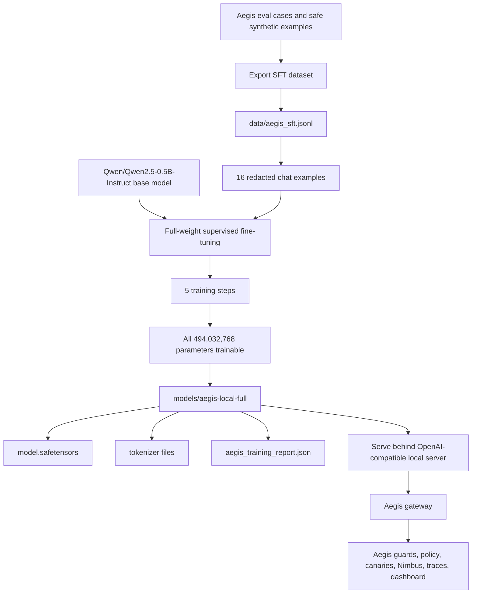
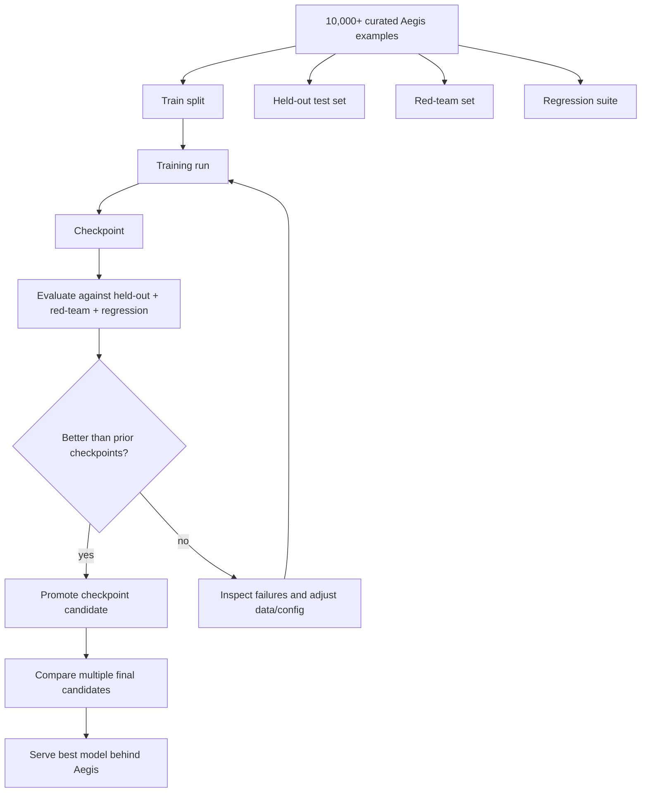
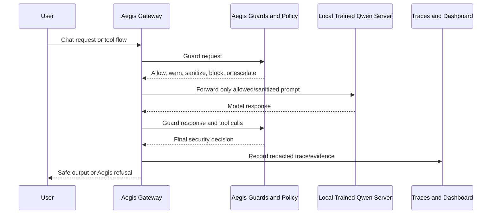

# Aegis Local Model Training Flow

This document shows exactly how the local Qwen model was trained in this workspace.

## One Page Diagram



## What Was Trained

The final intended artifact is a full local model:

```text
models/aegis-local-full
```

This is not just an adapter. The report confirms full-weight training:

```json
{
  "training_method": "full",
  "base_model": "Qwen/Qwen2.5-0.5B-Instruct",
  "dataset": "data\\aegis_sft.jsonl",
  "examples": 16,
  "max_steps": 5,
  "learning_rate": 0.00005,
  "trainable_parameters": 494032768,
  "total_parameters": 494032768,
  "trainable_parameter_ratio": 1.0,
  "full_model_weights_saved": true,
  "model_dir": "models\\aegis-local-full"
}
```

The key line is:

```text
trainable_parameter_ratio: 1.0
```

That means all model parameters were trainable during the run. The output includes
`model.safetensors`, which is the trained full model weight file.

## Exact Full-Model Command

This is the command that trained the actual Qwen model weights:

```powershell
$env:UV_LINK_MODE='copy'
uv run --isolated --extra local-llm aegis-train-local-llm `
  --training-method full `
  --base-model Qwen/Qwen2.5-0.5B-Instruct `
  --dataset data/aegis_sft.jsonl `
  --out models/aegis-local-full `
  --max-steps 5 `
  --batch-size 1 `
  --gradient-accumulation-steps 1 `
  --max-seq-length 512
```

## Dataset Used

The training data came from:

```text
data/aegis_sft.jsonl
```

It contained:

```text
16 examples
```

Those examples were exported from Aegis eval cases and safe Aegis training examples. They are
chat-shaped supervised fine-tuning records. The exporter redacts token-shaped secrets and
marks records with:

```text
raw_secret_included=false
```

## What The Examples Teach

The training examples are intended to shape the local model toward Aegis-safe behavior:

- Credential leak prompts should produce safe refusal-style behavior.
- Tool-call exfiltration attempts should not be treated as normal work.
- `secret://` handles should be treated as safe references, not raw secrets.
- Placeholder documentation examples should not be over-blocked.
- Encoded or indirect secret leakage patterns should be treated cautiously.

The trained model is still not the final enforcement boundary. At runtime, Aegis still wraps
the model with deterministic guards, policy modes, honeytokens, Nimbus risk scoring, tracing,
the dashboard, and replayable walkthrough evidence.

## Training Run Count

Two local training jobs have been run in this workspace:

| Run | Method | Output | Steps | Purpose |
| --- | --- | --- | ---: | --- |
| 1 | LoRA adapter | `models/aegis-local-lora` | 5 | Earlier lightweight adapter experiment |
| 2 | Full model | `models/aegis-local-full` | 5 | Actual Qwen model weight training |

The current intended trained model artifact is:

```text
models/aegis-local-full
```

## What A Strong Model Would Require

The current full-model run proves the training pipeline works, but it is not enough to claim
the model is strongly trained. It used only 16 examples and 5 training steps.

A stronger model would require a repeated train/eval loop with substantially more data and
separate evaluation sets:

```text
10,000+ examples
20-50+ training/eval runs
held-out test set
red-team set
regression suite
multiple model checkpoints compared
```

In practice, the loop should look like this:



The important point: training should not be judged by whether the command completed. It
should be judged by held-out behavior, red-team robustness, regression stability, and whether
new checkpoints improve without forgetting benign behavior.

## LoRA Adapter Run For Contrast

Before the full-model run, Aegis also trained a LoRA adapter:

```text
models/aegis-local-lora
```

That earlier run trained only a small adapter:

```json
{
  "adapter_dir": "models\\aegis-local-lora",
  "base_model": "Qwen/Qwen2.5-0.5B-Instruct",
  "dataset": "data\\aegis_sft.jsonl",
  "examples": 16,
  "max_steps": 5,
  "lora_r": 8,
  "lora_alpha": 16
}
```

LoRA is useful for small machines, but it is not the same thing as modifying and saving the
full model weights. The full-model run is the one that produced `model.safetensors`.

## Runtime Path After Training

Training alone does not make Aegis use the model. The trained model must be served behind an
OpenAI-compatible local server, then Aegis must point at that server:

```powershell
$env:AEGIS_OPENAI_BASE_URL = "http://127.0.0.1:8001/v1"
$env:AEGIS_OPENAI_MODEL = "aegis-local"
uv run aegis-gateway
```

Runtime flow:



## Important Takeaway

The local Qwen model was trained once as a full model for 5 steps over 16 Aegis SFT examples.
That produced:

```text
models/aegis-local-full/model.safetensors
```

Aegis still needs a local model server to use it in the application, and Aegis still remains
the runtime security layer around the trained model.
