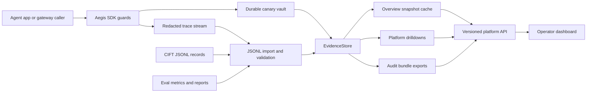
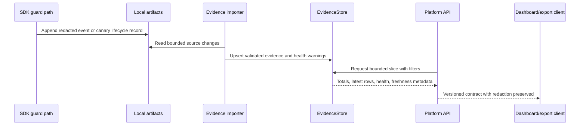
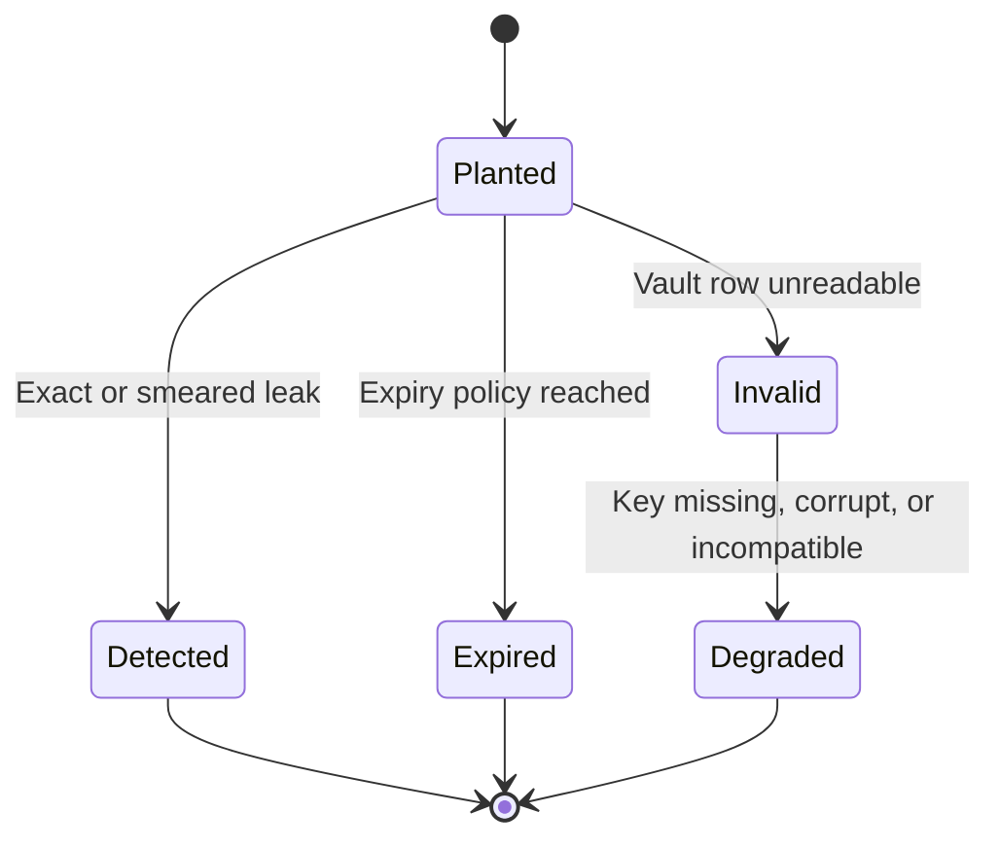
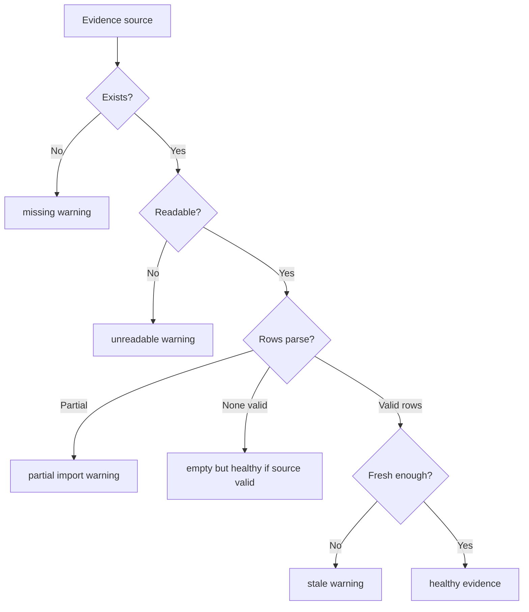
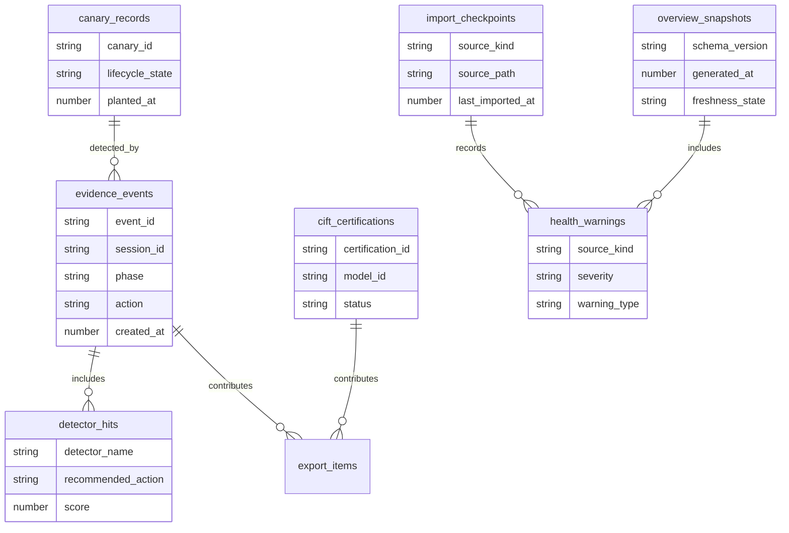
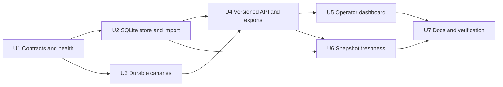

# feat: Build Aegis production platform vNext

> **Implementation status (2026-06-26):** this plan has been executed. The shipped system
> now includes the bounded SQLite evidence store, durable encrypted canary vault,
> versioned platform API, audit exports, operator dashboard, freshness/health semantics,
> and documentation updates described here. Treat this file as a historical execution
> plan; `README.md` and `architecture.md` are the canonical current explanation. Observe +
> Learn online ML was added after this plan and is documented in those canonical files.

## Summary

Build the production-shaped platform layer around the existing SDK guard path. The work
keeps guard decisions in the SDK, then hardens the surrounding evidence, canary,
API, dashboard, export, verification, and documentation surfaces so the platform can
support security-engineer investigation without overclaiming enterprise readiness.

---

## Problem Frame

Aegis already has the most important security spine: SDK guard methods inspect
requests, tool-call arguments, and responses; the gateway wraps that same SDK; traces,
CIFT records, eval metrics, and the dashboard provide capstone-grade proof. The current
platform layer is still mostly an in-process aggregation of local files. It reads all
trace rows, treats corrupt artifacts as empty, keeps canaries only in memory, exposes
unbounded API query parameters, and leaves the dashboard with duplicated parsing logic.

The vNext platform should make the existing defense path durable, inspectable, and
truthful for a security engineer. It should not rewrite detection, replace the SDK as the
source of truth, or pretend Basic Auth plus local state is an enterprise SaaS boundary.

---

## Requirements

### Evidence Backbone

- R1. Aegis exposes one platform evidence boundary for dashboard, API, export, and report
  consumers.
- R2. Existing local JSONL traces, eval metrics, CIFT JSONL records, and safe canary
  metadata remain compatible import inputs.
- R3. Evidence reads are bounded by default and reject or clamp unsafe query windows.
- R4. Platform summaries distinguish total matching records from the latest visible
  window.
- R5. Platform summaries include freshness and health state for missing, corrupt, stale,
  or partially imported evidence.
- R6. Overview reads use cached snapshots or equivalent behavior with explicit freshness
  semantics.

### Canary Durability

- R7. Planted canaries survive process restart for detection.
- R8. Persisted canary state avoids casual plaintext exposure of raw canary values.
- R9. Canary metadata in APIs, dashboard, exports, and traces remains display-safe.
- R10. Canary lifecycle state distinguishes planted, detected, expired, and invalid or
  unreadable records.
- R11. Missing keys, corrupt stores, or incompatible canary state appear as degraded
  platform health.

### Versioned Platform API

- R12. Platform API responses include schema version and query metadata.
- R13. Drilldowns cover decisions, sessions, detectors, canaries, CIFT records, and
  evidence health without forcing callers to parse raw JSONL files.
- R14. API responses preserve redaction guarantees already expected by traces and the
  dashboard.
- R15. Totals mean all matching records, and latest means the returned window.
- R16. Audit bundles are available in machine-readable and human-readable forms while
  preserving redaction.

### Operator Console

- R17. The dashboard helps the security engineer answer what happened, what changed,
  what evidence is degraded, and what can be exported.
- R18. Health and stale-state warnings appear near the evidence they affect.
- R19. Filters and drilldowns cover session, action, phase, detector, model or
  certificate, and time window where those dimensions exist.
- R20. The dashboard consumes the platform evidence boundary instead of duplicating file
  parsing logic.
- R21. Empty states distinguish no records from missing or unreadable records.

### Testing and Verification

- R22. Store contract tests cover counts, latest windows, health warnings, import
  behavior, empty state, and corrupted input.
- R23. Canary tests prove post-restart detection for exact and smeared appearances in
  model output and tool-call arguments.
- R24. Gateway/API tests cover version metadata, bounded query behavior, truthful totals,
  redaction, degraded evidence, and export behavior.
- R25. Dashboard tests cover operator-visible health, stale state, filters or drilldowns,
  and consumption of the platform boundary.
- R26. The offline verify gate stays deterministic and does not require live model,
  Braintrust, hosted database, or external secret-manager access.

### Claim Discipline and Documentation

- R27. README and architecture docs separate the shipped capstone MVP from production
  vNext capabilities.
- R28. Deployment docs explain Basic Auth as demo-grade access control and name sensitive
  evidence exposed behind it.
- R29. Deployment docs describe local state backup, restore, and key-loss behavior.
- R30. Docs preserve the non-goal that vNext is not full enterprise SaaS with billing,
  tenant management, compliance workflows, or full SSO.

---

## Key Technical Decisions

- KTD1. Keep the SDK guard path authoritative: the platform stores, summarizes, and
  explains SDK and gateway evidence; it does not make separate security decisions.
- KTD2. Introduce an `EvidenceStore` boundary: gateway, dashboard, exports, and reports
  read through one service instead of scanning local artifacts independently.
- KTD3. Use SQLite as the local queryable evidence store: it is in the Python standard
  library, supports bounded queries and indexes, and keeps the capstone offline gate free
  of hosted database dependencies.
- KTD4. Keep JSONL import and fallback paths: existing traces, CIFT records, and eval
  reports remain source artifacts and migration inputs while SQLite becomes the bounded
  read model.
- KTD5. Add explicit evidence health: loader failures, corrupt rows, missing artifacts,
  partial imports, and stale snapshots become structured warnings rather than empty
  evidence.
- KTD6. Protect durable canaries with encrypted raw-token storage plus a keyed lookup
  index: detection can restore after restart, while normal evidence views continue to
  expose safe metadata only.
- KTD7. Add a small runtime dependency for canary encryption: `cryptography` is justified
  by the durable raw-token requirement; storage remains stdlib SQLite.
- KTD8. Version the platform API contract: overview, drilldowns, health, and exports share
  schema version, query metadata, total count, latest-window semantics, and redaction
  guarantees.
- KTD9. Use cached overview snapshots with documented freshness defaults: live snapshots
  refresh after 5 seconds and are marked stale after 60 seconds unless configuration
  overrides them; static dashboard generation embeds a generated timestamp without a
  background refresh promise.
- KTD10. Export both JSON and Markdown audit bundles: JSON supports tooling, and Markdown
  supports human review and capstone evaluation.
- KTD11. Leave identity as an accepted risk: Basic Auth remains the access boundary for
  this slice, and docs must say what that means for sensitive evidence exposure.
- KTD12. Version local store schema separately from API schema: persistent state needs
  migration metadata, import checkpoints, and backup/restore docs so SQLite can evolve
  without corrupting existing evidence.
- KTD13. Centralize platform state and key configuration in `Settings`: default local
  platform state lives under the existing `.aegis` state root, and durable canary matching
  must require an operator-provided key rather than silently generating a throwaway key on
  gateway startup.

---

## High-Level Technical Design

The diagrams below are directional. They name component relationships and lifecycle
states, not implementation signatures.

### Component Topology



### Evidence Read Flow



### Canary Lifecycle



### Health Classification



### Evidence Store Entities



### Output Structure

```text
src/aegis/platform/
  evidence.py          existing overview models evolve into versioned contracts
  store.py             EvidenceStore protocol, query models, health types
  sqlite_store.py      local SQLite adapter, schema setup, bounded reads
  importers.py         JSONL, eval metrics, CIFT, and trace import helpers
  snapshots.py         overview cache and freshness handling
  exports.py           redacted JSON and Markdown audit bundles
  canaries.py          durable canary vault and lifecycle projections
src/aegis/detectors/honeytokens.py
  HoneytokenRegistry integrates optional durable backing
src/aegis/gateway/app.py
  API routes move to versioned platform service methods
src/aegis/dashboard/render.py
  dashboard renders platform contract and stops reading evidence files directly
tests/
  platform store, canary persistence, API contract, dashboard operator states,
  export, and verify-gate coverage
```

---

## Phased Delivery



---

## Implementation Units

### U1. Platform Contracts and Evidence Health

**Goal:** Define the shared platform contract that API, dashboard, exports, and tests
consume.

**Covers:** R1, R3, R4, R5, R12, R14, R15, R21.

**Flow and acceptance trace:** F1, F3, AE1, AE2, AE6.

**Primary touchpoints:** `src/aegis/platform/evidence.py`, `src/aegis/platform/store.py`,
`src/aegis/platform/__init__.py`, `tests/test_platform.py`.

**Design notes:**

- Add stable query, pagination/window, health, freshness, and count models.
- Preserve existing `PlatformOverview` intent while moving ambiguous fields toward
  versioned response models.
- Model totals and latest windows explicitly for decisions, CIFT, canaries, sessions,
  detector hits, and health.
- Represent skipped files and corrupt rows as warning records with source, severity, and
  display-safe detail.

**Test scenarios:**

- Given more decision records than the default window, overview reports total count and
  only the bounded latest rows.
- Given negative, zero, and excessive limits, contract-level validation rejects or clamps
  them consistently.
- Given corrupt trace and valid trace artifacts, valid evidence remains visible and the
  corrupt artifact appears in health.
- Given no records and healthy sources, the contract distinguishes empty evidence from
  unreadable evidence.

**Done when:** The platform package exposes a typed contract with stable count, query, and
health semantics that can be used before the SQLite adapter lands.

### U2. SQLite EvidenceStore and JSONL Import

**Goal:** Replace all-row local aggregation with a bounded local read model while keeping
existing artifacts compatible.

**Covers:** R1, R2, R3, R4, R5, R6, R13, R15, R22, R26.

**Flow and acceptance trace:** F1, F3, AE1, AE2.

**Primary touchpoints:** `src/aegis/platform/sqlite_store.py`,
`src/aegis/platform/importers.py`, `src/aegis/cift/store.py`, `src/aegis/tracing.py`,
`tests/test_platform_store.py`, `tests/test_cift.py`.

**Design notes:**

- Store validated evidence rows in SQLite tables keyed for session, phase, action,
  detector, model, certification, canary, and created time.
- Keep raw JSONL as import input and fallback proof, but make platform reads query the
  store.
- Use parameterized queries, explicit transactions, row factories, and indexed time/order
  fields.
- Enable WAL where supported for local read/write concurrency, but degrade gracefully if
  the platform cannot switch journal mode.
- Store schema version, import checkpoints, and source fingerprints so backfills can be
  idempotent and future migrations have an audit trail.
- Put the SQLite path under the shared platform state root so local traces, CIFT records,
  evidence store, and canary vault have one backup/restore story.
- Importers record per-source checkpoints and health rather than assuming every row is
  readable.

**Test scenarios:**

- Given existing trace JSONL files, import produces the same redacted decision summaries
  as the current overview.
- Given CIFT records where total count exceeds the visible limit, store queries return a
  truthful total and a latest window.
- Given a corrupt JSONL line, import records a warning and continues importing later valid
  rows.
- Given no SQLite file, the store initializes deterministically under a temporary state
  directory.
- Given repeated imports of the same artifact, rows are not duplicated.

**Done when:** Platform overview and drilldown data can be served from the store with
bounded queries, truthful totals, and visible import health.

### U3. Durable Canary Vault and Registry Restore

**Goal:** Make planted canaries restart-safe without exposing raw canary values in normal
evidence views.

**Covers:** R7, R8, R9, R10, R11, R23, R29.

**Flow and acceptance trace:** F2, F3, AE3, AE4.

**Primary touchpoints:** `src/aegis/platform/canaries.py`,
`src/aegis/detectors/honeytokens.py`, `src/aegis/client.py`, `src/aegis/config.py`,
`pyproject.toml`, `tests/test_canary_persistence.py`, `tests/test_honeytokens.py`.

**Design notes:**

- Persist raw canaries encrypted at rest, plus safe metadata and lifecycle state.
- Maintain a keyed lookup index for exact and normalized matching after restart.
- Load vault records into `HoneytokenRegistry` at client startup when a key is configured.
- Read the canary vault key through Settings/environment configuration and treat absent
  key as an operator-visible degraded state, not an opportunity to create a new implicit
  key.
- If the key is missing, invalid, or the vault is corrupt, keep safe metadata readable and
  report canary matching as degraded.
- Detecting a canary updates lifecycle state and links detector evidence to safe metadata.
- Support an explicit expired state even if automatic expiration policy remains minimal in
  the first implementation.

**Test scenarios:**

- Given a canary planted before restart, a new client with the same vault and key blocks
  the exact token in response output.
- Given the same setup, a smeared token in response output and in tool-call arguments is
  blocked after restart.
- Given the raw token appears in a trace, dashboard, API response, or export, the test
  fails; only safe metadata may appear.
- Given a missing or invalid vault key, canary safe metadata remains visible and health
  warns that restart detection is degraded.
- Given corrupt vault rows, valid rows are restored and invalid rows produce health
  warnings.

**Done when:** Restart-safe detection is proven for exact and normalized canary leaks, and
key-loss behavior is visible rather than silent.

### U4. Versioned Platform API, Drilldowns, and Audit Exports

**Goal:** Turn the platform surface into a versioned API with bounded drilldowns and
redacted export bundles.

**Covers:** R3, R12, R13, R14, R15, R16, R24.

**Flow and acceptance trace:** F1, F3, F4, AE1, AE2, AE5.

**Primary touchpoints:** `src/aegis/gateway/app.py`, `src/aegis/gateway/models.py`,
`src/aegis/platform/evidence.py`, `src/aegis/platform/exports.py`,
`tests/test_platform_api.py`, `tests/test_gateway.py`.

**Design notes:**

- Add version metadata to overview and drilldown responses.
- Apply bounded numeric query validation to all platform evidence endpoints.
- Route decisions, sessions, detectors, canaries, CIFT, and health through the store.
- Keep existing gateway guard endpoints stable; the platform API evolves around them.
- Produce JSON audit bundles for tools and Markdown bundles for human review.
- Exports include query metadata, health state, redacted decisions, detector evidence,
  safe canary metadata, CIFT status, and eval context where available.

**Test scenarios:**

- Given an overview request, the response contains schema version, generated timestamp,
  query metadata, total counts, latest windows, and health.
- Given excessive limits on platform endpoints, the API rejects or clamps them
  consistently.
- Given a filtered session export, JSON and Markdown outputs contain the same redacted
  evidence scope.
- Given detector evidence with secret-looking content, the API and exports preserve
  redaction.
- Given corrupted evidence sources, health endpoints and exports include warnings near
  affected data.

**Done when:** API consumers can inspect platform evidence and export audit bundles
without parsing raw JSONL files.

### U5. Operator Dashboard Through the Platform Boundary

**Goal:** Make the dashboard an investigation console, not a second evidence parser.

**Covers:** R17, R18, R19, R20, R21, R25.

**Flow and acceptance trace:** F1, F3, F4, AE2, AE4, AE6.

**Primary touchpoints:** `src/aegis/dashboard/render.py`, `src/aegis/dashboard/cli.py`,
`src/aegis/gateway/app.py`, `tests/test_dashboard.py`, `tests/test_gateway.py`.

**Design notes:**

- Render the platform contract directly for both live and static dashboard modes.
- Show health and stale warnings next to the affected evidence areas.
- Add operator drilldowns or filter surfaces for session, action, phase, detector, model
  or certificate, and time window where the data exists.
- Keep the UI restrained and operational: dense, scannable evidence first; decorative
  redesign is out of scope.
- Empty-state copy must distinguish healthy empty data from missing, unreadable, or stale
  evidence.

**Test scenarios:**

- Given platform health warnings, dashboard HTML shows them near affected evidence
  sections.
- Given stale overview metadata, dashboard renders stale state instead of a healthy live
  state.
- Given filters or drilldown links, rendered output preserves selected query metadata and
  does not bypass the platform contract.
- Given no decisions but healthy sources, dashboard shows a no-records empty state.
- Given unreadable evidence, dashboard shows degraded state and still renders valid
  sections.

**Done when:** The dashboard no longer owns evidence parsing and can support the security
engineer's investigation path through the shared platform contract.

### U6. Snapshot Freshness and Performance Semantics

**Goal:** Keep overview reads bounded and understandable under repeated gateway and
dashboard requests.

**Covers:** R3, R5, R6, R15, R22, R24, R25, R26.

**Flow and acceptance trace:** F1, F3, AE1, AE2, AE6.

**Primary touchpoints:** `src/aegis/platform/snapshots.py`, `src/aegis/platform/store.py`,
`src/aegis/gateway/app.py`, `tests/test_platform_store.py`, `tests/test_gateway.py`.

**Design notes:**

- Cache overview snapshots for the configured freshness window.
- Default live snapshot refresh interval is 5 seconds, matching the current dashboard
  refresh cadence; default stale warning threshold is 60 seconds.
- Include cache age, generated time, refresh source, and stale state in platform metadata.
- Never allow stale snapshots to hide store health warnings or key-loss warnings.
- Static generation embeds generated time and source health rather than promising live
  refresh.

**Test scenarios:**

- Given repeated overview requests inside the freshness window, the same snapshot metadata
  is reused.
- Given source evidence changes after the refresh interval, the next overview refreshes
  counts and latest rows.
- Given a snapshot older than the stale threshold, API and dashboard mark it stale.
- Given store health warnings during cached reads, warnings remain present.
- Given cache disabled in tests, reads remain deterministic.

**Done when:** Operators can tell whether the overview is fresh, cached, stale, or
degraded, and repeated reads stay bounded.

### U7. Documentation, Deployment Notes, and Verification Gate

**Goal:** Tie the platform vNext implementation to claim discipline and deterministic
verification.

**Covers:** R26, R27, R28, R29, R30, SC1, SC2, SC3, SC4, SC5, SC6.

**Flow and acceptance trace:** F2, F3, F4, AE3, AE4, AE5.

**Primary touchpoints:** `README.md`, `CLAUDE.md`, `AEGIS_TECHNICAL_PLAN.md`,
`docs/designs/aegis-production-platform-vnext.md`, `architecture.md` if promoted,
`src/aegis/verify.py`, `tests/`.

**Design notes:**

- Update README platform sections to separate shipped capstone MVP from vNext platform
  capabilities.
- Document Basic Auth as demo-grade access control and name evidence exposed behind it.
- Document local state paths, backups, restore, canary key loss, and degraded recovery.
- Keep the offline verify gate deterministic: no live LLM, Braintrust, hosted database,
  or external secret manager.
- Reconcile any promoted architecture narrative with the tracked source docs.

**Test scenarios:**

- Given `aegis-verify`, the new platform, canary, API, dashboard, and export tests run
  offline.
- Given docs mention vNext platform behavior, they also preserve limitations around Basic
  Auth, local state, no RBAC, no tenancy, and no formal prevention guarantee.
- Given canary key-loss behavior, README or deployment docs explain the operator-visible
  recovery state.
- Given a security reviewer follows the docs, they can produce a redacted audit bundle
  without live services.

**Done when:** The implementation claims are demonstrably narrower than the code and tests
now support, and the repo's gate proves the vNext slice offline.

---

## Acceptance Examples

- AE1. Given more platform records than the default visible window, overview reports total
  matching records separately from returned latest rows and includes schema/query metadata.
- AE2. Given one corrupt evidence artifact and one valid artifact, dashboard renders valid
  evidence and a health warning for the corrupt source.
- AE3. Given a canary planted before restart, a later response or tool-call leak is blocked,
  linked to safe metadata, and never exposes the raw token in normal evidence views.
- AE4. Given the canary key is missing or invalid, operator-visible health marks detection
  degradation and docs explain recovery or loss behavior.
- AE5. Given a blocked session with detector evidence and canary metadata, audit export
  explains the block without leaking secrets or raw canary tokens.
- AE6. Given the dashboard renders platform data, platform contract health and count
  changes are caught by dashboard tests.

---

## System-Wide Impact

- Data lifecycle: local JSONL remains useful as source evidence, but SQLite becomes the
  bounded platform read model and must be treated as state worth backing up.
- Migration lifecycle: SQLite schema changes need explicit version metadata, idempotent
  migration steps, and tests that seed old-shaped local state before upgrading.
- Security posture: durable canaries require encrypted raw-token storage and explicit key
  handling; key loss must not look like healthy detection.
- API contract: `/api/platform/overview` becomes one endpoint in a versioned platform API
  family rather than a single ad hoc aggregate.
- Dashboard contract: dashboard rendering shifts from local file parsing to rendering a
  shared platform contract.
- Documentation contract: production-shaped platform claims must remain tied to shipped
  code and tests, while identity and SaaS capabilities remain out of scope.

---

## Risks and Dependencies

| Risk | Mitigation |
| --- | --- |
| SQLite store drifts from source JSONL artifacts | Keep import checkpoints, idempotent imports, and tests comparing imported summaries with existing JSONL-derived behavior. |
| Canary encryption key loss silently disables restart detection | Surface degraded health, keep safe metadata readable, document backup/restore behavior, and test missing/invalid key paths. |
| New API schema breaks existing demo consumers | Keep current guard endpoints stable, version platform responses, and update dashboard/tests against the versioned contract. |
| Dashboard grows into a decorative redesign | Constrain dashboard work to operator states, filters, drilldowns, exports, and health warnings. |
| Export bundles leak sensitive values | Reuse existing redaction helpers, test raw secret and raw canary absence, and include health metadata so exports are complete without raw artifacts. |
| Basic Auth is mistaken for enterprise access control | Keep identity out of implementation scope and make README/deployment limitations explicit. |
| Local store migration damages evidence | Version the SQLite schema, test upgrade from seeded old-shaped state, keep JSONL source artifacts as replayable fallback, and document backup before migration. |
| WAL or local file locking behaves differently by platform | Treat WAL as an optimization, surface store errors as health warnings, and keep tests deterministic with temporary local stores. |
| New encryption dependency complicates install or deploy | Keep it focused to canary vault support, document required key configuration, and ensure missing dependency or key paths degrade visibly in tests. |

Dependencies:

- Python 3.11+ standard `sqlite3` for local persistence.
- `cryptography` for protected canary vault encryption.
- FastAPI/Pydantic validation already in the stack for bounded query parameters and typed
  response models.

---

## Alternative Approaches Considered

- JSONL-only aggregation: rejected because it keeps all-row reads, ambiguous totals, and
  weak query/filter semantics.
- Hosted database first: rejected because the offline verify gate and capstone deploy
  should not depend on hosted infrastructure.
- HMAC-only canary persistence: rejected because it can avoid plaintext but cannot restore
  exact and normalized matching without enough protected raw material.
- Full secret-manager integration: deferred because it is a production secret-management
  project, not necessary for the local vNext slice, and already outside current scope.
- Dashboard-first redesign: rejected because operator trust depends on evidence health,
  drilldowns, and exports before visual polish.

---

## Scope Boundaries

### Deferred to Follow-Up Work

- Long-term retention, pruning, and archival policy beyond explicit freshness and health.
- Tamper-evident or signed audit bundles.
- Incident assignment, collaboration, or ticketing workflows.
- Migration path from local SQLite to a hosted production database.

### Deferred for Later

- Full enterprise identity, SSO, RBAC, tenancy, and billing.
- Production secret-manager integration and automatic credential rotation.
- Hosted multi-tenant operations and compliance workflows.
- Broader detector or policy rewrites unrelated to the platform evidence boundary.
- External SIEM integrations beyond local exportable bundles.

### Outside This Product's Identity for vNext

- Replacing the SDK guard path with a separate platform security engine.
- Claiming formal credential-exfiltration prevention guarantees.
- Treating Braintrust, live LLM access, or a hosted database as required for local
  verification.

---

## Documentation and Operational Notes

- README should show the current MVP, then the vNext platform layer, with clear language
  about what is implemented after this work.
- Deployment notes should identify the shared platform state root and the state paths for
  traces, CIFT records, SQLite evidence, and canary vault files.
- Key-loss docs should state that historical safe metadata can remain readable while
  restart canary matching is degraded until the correct key is restored.
- Migration docs should state when a local evidence backup is recommended and how JSONL
  source artifacts can be replayed into the store.
- Export docs should explain JSON versus Markdown bundle uses and redaction guarantees.
- Architecture docs should reconcile the tracked technical plan with any promoted
  architecture narrative before claiming the vNext shape.

---

## Sources and Research

- `docs/brainstorms/2026-06-25-aegis-production-platform-vnext-requirements.md` -
  accepted actors, requirements, flows, success criteria, and scope boundaries.
- `docs/designs/aegis-production-platform-vnext.md` - CEO and engineering review direction.
- `CLAUDE.md` - SDK-source-of-truth rule, hard non-goals, and offline verify gate.
- `README.md` - current claim discipline, gateway endpoints, platform overview, and
  limitations language.
- `src/aegis/platform/evidence.py` - current local-file-backed platform overview.
- `src/aegis/gateway/app.py` - current FastAPI gateway and `/api/platform/overview`.
- `src/aegis/dashboard/render.py` - dashboard rendering and duplicated file readers.
- `src/aegis/detectors/honeytokens.py` and `src/aegis/client.py` - in-memory canary
  registry, plant path, redaction, and detector integration.
- `src/aegis/cift/store.py` - JSONL CIFT storage and current latest-window behavior.
- `tests/test_platform.py`, `tests/test_gateway.py`, `tests/test_dashboard.py`,
  `tests/test_honeytokens.py` - current platform, gateway, dashboard, and canary coverage.
- Python `sqlite3` documentation - local disk database, parameter binding, transactions,
  row factories: <https://docs.python.org/3/library/sqlite3.html>.
- SQLite WAL documentation - local read/write concurrency and checkpoint behavior:
  <https://www.sqlite.org/wal.html>.
- FastAPI numeric query validation documentation - bounded query parameters:
  <https://fastapi.tiangolo.com/tutorial/path-params-numeric-validations/>.
- Cryptography Fernet documentation - symmetric encryption and key rotation support:
  <https://cryptography.io/en/latest/fernet/>.
- OWASP Secrets Management Cheat Sheet - lifecycle, auditing, backup, restore, and
  rotation considerations: <https://cheatsheetseries.owasp.org/cheatsheets/Secrets_Management_Cheat_Sheet.html>.
